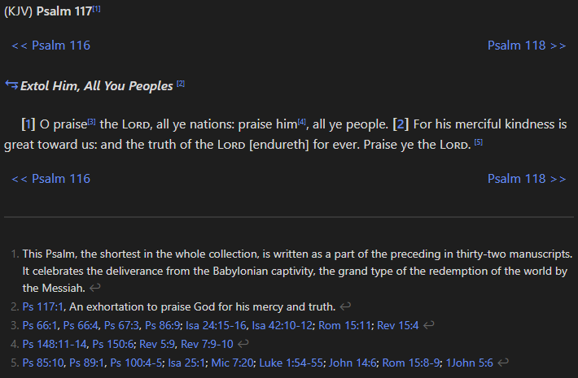

---
tags:
---
# Quick Start & User Guide

Welcome to the Bruhman Translator's Bible! 

This guide will help you get oriented and start exploring.

## Start Here!

### Installation

- Either clone this repository or download the latest release and un-zip it on your computer.
- Install Obsidian from [HERE](https://obsidian.md). It's free!
- When you run Obsidian, **Open folder as vault**, and select the location where you downloaded or un-zipped the BTB files.
  
  

- **Be patient!!** It's worth it. It can take up to an hour the first time you open the Bible. During this time Obsidian is building a database of all the files and how they connect. Once the first indexing is complete, everything will work very fast.
- Look up a video on how to use Obsidian while you wait. A clever person who is handy with Obsidian will enjoy this Bible the most.

### First Things First

There are a few things in the Obsidian environment you'll need to do, or at least check, before you get started.  Even though this Bible was designed in a minimalist fashion and requires no additional plugins, you must turn on CSS snippets, and there are a couple of settings that the BTB was designed to work best with that you should check:

#### Update Obsidian Settings

1. Use the gear icon  below to open Obsidian's settings

2. Go to **Editor**

3. Make sure the **default view is Reading view**

4. Go to **Appearance** 

5. **Turn OFF** Inline titles

6. Scroll to the bottom and **turn on CSS Snippets** - **You MUST turn on CSS Snippets**

   If you don't see btb.css in the CSS snippets path, you can copy btb.css from the BTB folder (where you cloned the repository or un-zipped the files) and drop it into the CSS snippet folder.  Get there by clicking on the folder icon next to "CSS snippets" in the Appearance Settings.

#### Quick Switcher

**Ctrl+O** PC (**Cmd+O** Mac) to launch the Quick Switcher, which you can use to navigate anywhere.

- search for a verse or chapter using dots as **book.chapter.verse** separators
  
  

- type: 'topic' + your topic of interest, to search the topical concordance
  
  

#### Command/Control + Click

Ctrl+click PC (cmd+click Mac) is your best friend.  By holding down the command key and clicking a link, it saves your spot in the file you are working in and opens the link in a new tab.  

You can also right-click a link, and use the context-menu to open a link by splitting the view. This allows you to see both files at the same time.

>[!info]
>This is probably the best place to mention that you can configure [Hotkeys in Obsidian](https://help.obsidian.md/hotkeys) for anything and everything.

#### Right Sidebar

The **right sidebar** is where you will access page properties, tags, and outlines...

- Click the Expand button in the top toolbar on the right side
  
  

- Then click the outline icon and use the headings for navigating this page
  
  

## How This Bible Works

### Reading the Bible

#### Chapters

Chapters are in paragraph format and from the King James Bible (KJV). The KJV was written in Early Modern English and can be difficult for modern readers to comprehend. While many modern translations like the ESV, NIV, or the scholarly NRSVue are more accessible, the KJV serves a unique purpose here: **its archaic language actually helps the translation process because you are less likely to plagiarize Early Modern English.** Instead, you are forced to create a new, personal, and hopefully meaningful, translation using your own words.

The shortest chapter in the Bible:

If you get stuck on the traditional KJV verse, you can hover your cursor over the verse number to reference the Berean Standard Bible (BSB) translation of the same verse, which is in modern English and represents the latest, critical texts and the last 100 years of Bible scholarship— resources that are usually very expensive and not available in the public domain.

The BSB was generously given to the public domain by the Berean Bible translation committee. Find out more about that translation [HERE](https://berean.bible/).

*I did reach out to the Friendship Press's rights management company about using the text of the NRSVue in place of the BSB text so that there could be wider adoption of the BTB in an academic space, but received a very kind and gracious denial of the request to use their text in this format.*

#### KJV Philosophy

All of that said, the KJV is a stunning and beautiful rendering of the scriptures, which has shaped all of modern Western thought more than any other book. (Over 1 billion—1,000,000,000+—is the conservative estimate of copies printed since 1611.) And for someone who might have a different theology, who might know Christ to be a living reality on an ethereal plane, who finds divine providence in the assemblage of the scriptures of the Christian Bible by many men, spanning many centuries, to be an earmark of Truth, and who finds the words of Jesus Christ to be infallible regardless of which translation the Holy Spirit is having to work with, a more poetic rendering of the scripture could be far more reflective of the intent of the original author than, say, a very precise translation according to the latest scholarly research which has been peer reviewed within the academy, but which has been altered to be more inclusive of a modern audience and diluted into mundane literature.

Or one can translate the scripture for oneself - see below.

Chapters also include copious footnotes from the Treasury of Scripture Knowledge—mostly cross-references, with many informational notes. Jesus' words are displayed in red text. The section titles are not canonical parts of the Bible, but were added from the BSB to create natural boundaries for coherent units within chapters. These boundaries were used to define the pericopes as [desribed below](#Pericopes).

### Studying the Scripture

Click on any verse number—either from the chapter view described above, or from a pericope as described below—to access that verse in the original language. All of the New Testament scripture was originally written in Koine Greek. Almost all of the Masoretic Text (Old Testament) was written in Hebrew, with exceptions being 268 verses, primarily in Daniel and Ezra, along with a few isolated phrases in Genesis, Jeremiah, and Proverbs, which were written in Jesus' native language of Aramaic. There are lexicon entries included for every Greek, Hebrew, and Aramaic word in the Bible (including every Greek word from the [Septuagint](#LXX) which isn't used in the Greek NT).

#### Verses

The shortest verse in the Bible:

In every verse view you see 3 different English translations of that verse: one from the KJV representing a traditional translation of the majority text, another from the BSB which represents a modern English translation of the critical text, and a literal, word-for-word translation from the original language into English.

The literal translation might feel a little choppy to an English-speaking reader because of how ancient Greek and Hebrew words organize differently from English. But over time, as you read the literal translations, an image of what is being expressed will emerge in your mind, much in the same way a more familiar pattern of English has a certain meaning and requires a certain understanding.

**The interlinear table has 4 columns:**

1. **Translation**: Gives you the direct translation of that word from the original language into English, applying the correct morphology for that usage of that word. Notice in the screenshot above that the first translation is "Wept," which is the past tense of the word "Weep." The tense of the word is implied by the form the word takes in the original language (2nd column). 

2. **Hebrew** or **Greek**: In the second column, you will see the word in the original Greek or Hebrew. In the screenshot, you see the first Greek word is **ἐδάκρυσεν**, which is the past tense form of the Greek root word **δακρύω**, "to weep." For a deeper look at the original language word, you can hover over or click the word to view it in the lexicon. See the [Lexicon section below](#Lexicon) for more details.

3. **Transliteration**: Gives you the original Greek or Hebrew word spelled in English. The details about the word's morphology are linked from the transliteration column in superscript links. (See screenshot above.)

4. **Texts**: The last column gives you a brief overview of which textual traditions include that word, or when that word appears in a different order in different manuscripts. Hover over the abbreviation for the full description and hover over the **Word Types and Editions** link for a detailed reference to the source texts and how they are applied.

Any differences in spelling, word order, inclusions and exclusions, or which words might fall in different verse numbers depending on the tradition—that information is footnoted and linked from the interlinear table where appropriate.

#### Lexicon

When you click on any Greek or Hebrew word, you are taken to the lexical entry for that word. The lexicon is compiled from every available source in the public domain, including: Strong's Exhaustive Concordance of the Bible, the Brown-Driver-Briggs Hebrew and English Lexicon, A Manual Greek Lexicon of the New Testament: Abbott-Smith, Liddell–Scott–Jones A Greek-English Lexicon, and several more modern and publicly available resources like [OpenScriptures.org's Hebrew Bible](https://github.com/openscriptures/morphhb), and the [Open Greek New Testament Project](https://github.com/eliranwong/OpenGNT)—these last two aiming to recreate the latest critical editions of the Masoretic Text and the NA 27/28 Greek New Testament, respectively.

The lexicon also includes many entries from **Translators Individualized Proper Names with all References (TIPNR)** from the [STEPBible Data repository](https://github.com/STEPBible/STEPBible-Data). This data disambiguates people and places and gives you additional information about specific people and places as they are mentioned in the scripture. All of the places from that dataset have been coded for Google Maps, but you will need a [Google Developer API Key](https://developers.google.com/maps/documentation/javascript) to use the feature. Once you obtain a Google Key, open the BTB folder with [VS Code](https://code.visualstudio.com/) and do a global find and replace of `[GoogleAPIKey]` in the `/lexicon/TIPNR` folder with your key from Google.

More information on how to use the lexicon is coming soon.

#### LXX

The Bible known to the 1st-century, Greek-speaking authors of the New Testament was the Septuagint (**LXX**). The Septuagint was a Greek translation of the Hebrew scriptures originally commissioned in Alexandria, Egypt, by Ptolemy II Philadelphus in the 3rd century BC (approx. 285–246 BC), who wanted a Greek translation of the scriptures made for Greek-speaking Hellenistic Jews.

As the legend goes, there were 72 scholars (six from each of the twelve tribes) who each translated the Torah (the first 5 books of the Jewish Bible) independently, and miraculously, all 72 translations were exactly the same. The number was later rounded to seventy, thus we use LXX to represent the Septuagint, which is the Roman numeral for 70. The rest of the Hebrew scriptures were translated into Greek and added to the Septuagint over the following centuries.

The Septuagint is included in this edition as a way to reference the actual scripture being quoted in the New Testament.  There are thousands of differences between the Septuagint and the Hebrew Masoretic Text that makes up the Old Testament.  This can cause confusion when you read a passage in the NT that references a verse in the OT, but the NT reference sounds very different from the OT verse.  This is often because the Greek author of the NT is referencing the Septuagint.  The Greek OT was added here to bridge that gap.

There is a link to the 'Greek Text' in every verse of the Old Testament, which corresponds to the Greek counterpart of that verse from the Septuagint. You can also search for Greek verses from the [Quick Switcher](#Quick%20Switcher) by prepending the verse reference with LXX. e.g. LXX.Gen.1.1 will pull up the Greek translation of Genesis 1:1.

>[!note]
>The Septuagint's verse and chapter numbering has been adapted to the KJV's versification scheme. Additionally, the Greek lexicon has been extended to cover all Greek words found in the Septuagint that are not found in the Greek New Testament.

The LXX text and interlinear data for this Bible were adapted from the Apostolic Bible Polyglot created by Dr. Charles Vanderpool. He offers a free PDF on his website [HERE](https://apostolicbible.com/) (click on Free Study Guide & Introduction) that has essential information on Koine Greek grammar for the beginner. From the introduction: **one does not have to know English grammar to learn Greek grammar.**

#### Scripture Quoting Scripture

There are also Scripture Quoting Scripture blocks included in every verse that references another verse in the Bible. All Old Testament references in the New Testament link to the verses referenced in the Septuagint.

### Translating the Scripture

#### Pericopes

In order to create a structured approach to studying this Bible, all of the verse sections from the chapter views have been converted to discrete ***pericope*** passages. Pericope (sounds like calliope, not like periscope) is a Greek word meaning "a cutting-out." In this Bible, a pericope is a selection of verses from a chapter that form one coherent unit or thought. The pericope titles come from the verse section headings of the BSB.

#### Accessing the Pericopes

There are three ways to find a peircope:
1. Use the arrows ⥃ next to the section headings in the chapter views
   
2. Use the arrows ⥂ next to the verse number on any verse view
   
3. Search for a pericope in the [My Translations base](/My%20Translations.base).  See the [My Translations](#My%20Translations) section below.

#### Structure

All pericopes have the same, simple structure: one verse per line, a blank line after each verse for your translation, and a section for your notes at the bottom:

>[!important] 
>The pericopes are for writing in your Bible. There are no rules or limits to how you decide to organize your notes. To get the most out of this Bible, research ways to use Obsidian's note-taking capabilities in your personal context.

#### Properties

By updating the properties of the pericopes, you can easily manage your work and stay organized. All pericopes come with the following properties, but there are no rules about which values to use. It's totally up to you what the statuses, priority levels, and difficulty levels mean for your Bible study or group work.

**Available properties:**

- **status** - Track the status of your work. Examples: Started, In Progress, Needs Work, Polished, Complete, Finished, Open, Closed—or create your own.
- **difficulty** - Indicate the level of difficulty of the passage (e.g., Easy, Moderate, Challenging).
- **priority** - Set priorities however you prefer: numbered (1, 2, 3), sequenced (Wait, Next, Now), or ranked (High, Medium, Low).
- **translation_date** - The date you completed your translation. Use **YYYY-MM-DD** format so Obsidian recognizes it as a date field.
- **needs_review** - A checkbox flag to mark passages that need additional review.

Access the right sidebar to view and update properties:

#### My Translations

In the main BTB folder there is a file called [My Translations.base](/My%20Translations.base) that is an [Obsidian Bases](https://help.obsidian.md/bases) file that effectively is a spreadsheet of all of the pericopes:

Using the properties in the pericopes as described above enables you to manage your translation work in the Bases interface:

---
***This only covers how to use this Bible in Obsidian. This is no way even scratches the surface of what else is possible by tapping into the community plugins and workflow methodologies promoted by users in the Obsidian communities.***